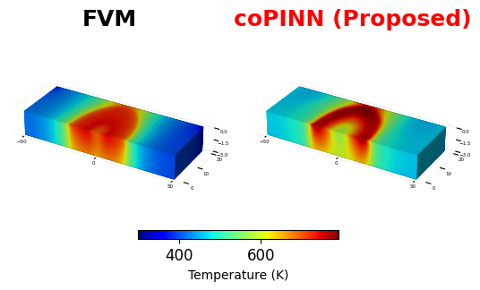

# Official Repository of Coupled Physics Informed Neural Networks for Additive Friction Stir Deposition Process

The main code are typically in the form of notebook. The notebook import required Python files from the same folder. 

