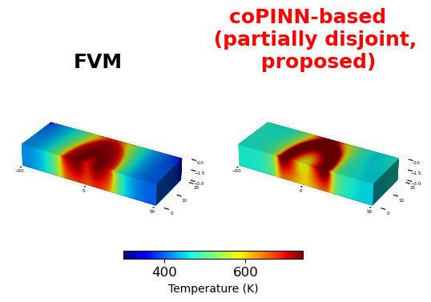

# Official Repository of Coupled Physics Informed Neural Networks for Additive Friction Stir Deposition Process

The main codes are typically in the form of Python notebooks. The notebook import requires Python files from the same folder. The codes are being improved for easy usage.



*R. Gnanasambandam et al., "Coupled Physics-Informed Neural Network for Multi-Physics Modeling in Additive Friction Stir Deposition," in IEEE Transactions on Automation Science and Engineering, doi: 10.1109/TASE.2025.3646558. keywords: {Additive Manufacturing;Partial Differential Equations;Numerical Methods;Physics Informed Neural Networks}*

```
@ARTICLE{11305145,
  author={Gnanasambandam, Raghav and Gotawala, Nikhil and Wu, Xiaofeng and Standfield, Benjamin and Dou, Chaoran and Yu, Hang Z. and Yu, Jian and Kong, Zhenyu},
  journal={IEEE Transactions on Automation Science and Engineering}, 
  title={Coupled Physics-Informed Neural Network for Multi-Physics Modeling in Additive Friction Stir Deposition}, 
  year={2025},
  volume={},
  number={},
  pages={1-1},
  keywords={Additive Manufacturing;Partial Differential Equations;Numerical Methods;Physics Informed Neural Networks},
  doi={10.1109/TASE.2025.3646558}}```
